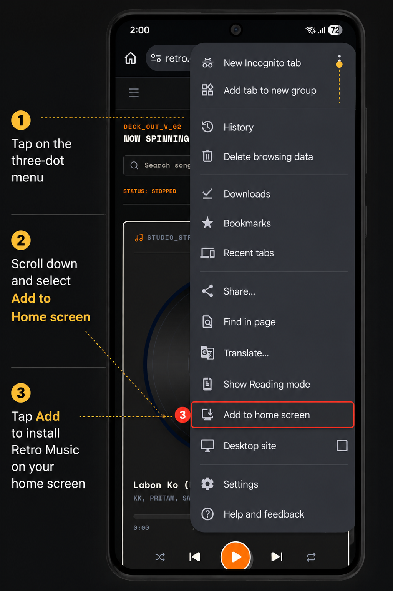
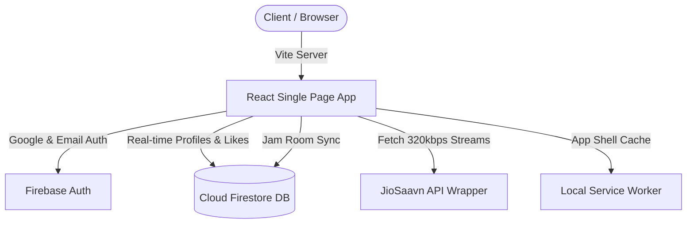

# 🎵 RETRO: The Ultimate Open-Source Music Streaming App


**RETRO** is a premium, open-source music streaming application built with modern web technologies (React, Vite, Tailwind CSS, Firebase). Designed as a fully-featured, free alternative to mainstream music apps (like Spotify or Apple Music), RETRO combines a striking **retro-brutalist aesthetic** with cutting-edge real-time audio streaming capabilities.

Whether you are looking for an **open source Spotify clone**, a robust **React music player**, or a platform to host **live listening parties (Jam Sessions)**, RETRO delivers an unparalleled, high-fidelity experience.

---

## 🌟 Key Features

### 🎧 High-Fidelity Global Music Streaming
- **Infinite Library**: Powered by a JioSaavn API wrapper, stream millions of songs in crystal-clear **320kbps audio**.
- **Smart Search & Discovery**: Instantly search for tracks, artists, and albums with our optimized search engine.
- **Trending Curations**: Discover what's hot with auto-updating daily trending charts and algorithmic smart queues.

### 👥 "Jam Together" Real-Time Sync (Listen Together)
- **Live Streaming Stations**: Create private or public "Jam Rooms" to listen to music simultaneously with friends across the globe.
- **Millisecond Audio Sync**: Built on WebSockets & Firebase real-time listeners, the playhead, play/pause state, and track selections are synchronized seamlessly between all users in a room.
- **Live Chat**: Discuss tracks in real-time while the music plays in the background.

### ☁️ Cross-Device Cloud Syncing
- **Real Firebase Authentication**: Securely log in using **Google OAuth** or traditional **Email & Password**.
- **Universal State Persistence**: Your Liked Songs, Custom Playlists, and Recently Played history are instantly saved to Firestore and synced across all your devices.
- **Seamless Resumption**: Auto-saves your exact playback timestamp and volume. Refresh the page or switch devices, and your music resumes exactly where you left off without missing a beat.

### 📱 Progressive Web App (PWA) Support
Install RETRO directly to your phone or desktop without app stores. 
- **Offline Caching**: Built-in Service Workers cache the app shell for instantaneous load times even on slow networks.
- **Native Feel**: Behaves like a native mobile app with a bottom navigation bar, persistent mini-player, and lock-screen audio controls.

### 🎨 Retro-Brutalist UI/UX
- **Unique Aesthetic**: Ditch the boring flat designs. RETRO utilizes a stark, high-contrast brutalist design language with CRT flickers, micro-animations, and bold typography.
- **Dynamic Theming**: Seamlessly switch between Light and Dark modes.

---

## 📱 How to Install the App (PWA)

Get the native app experience on your phone in seconds:

| Step | Action |
|------|--------|
| 1️⃣ | Open the website in **Google Chrome** (Android) or **Safari** (iOS). |
| 2️⃣ | Tap the **⋮** menu (Chrome) or **Share icon** (Safari). |
| 3️⃣ | Select **Add to Home screen**. |
| 4️⃣ | Tap **Install** or **Add**. |
| 5️⃣ | Open **Retro Music** from your app drawer! |

<p align="center">
  
</p>

---

## 💻 Tech Stack

- **Frontend Core**: React 18, Vite, TypeScript
- **Styling**: Tailwind CSS, Framer Motion (Animations), CSS Modules
- **Backend / Real-time**: Firebase Authentication, Cloud Firestore (NoSQL Database)
- **Audio Engine**: HTML5 Web Audio API & custom Synth-Oscillator Fallbacks
- **Offline & Cache**: Custom Service Workers, IndexedDB, LocalStorage

---

## 🛠️ Setup & Running Locally

Want to contribute or run your own local instance of this music player?

### 1. Prerequisites
- [Node.js](https://nodejs.org/) (v18 or higher recommended)

### 2. Environment Variables (`.env`)
To enable full database syncing, create a `.env` file in the root directory and add your Firebase credentials:
```env
# Firebase Configuration
VITE_FIREBASE_API_KEY="your_api_key_here"
VITE_FIREBASE_AUTH_DOMAIN="your_auth_domain_here"
VITE_FIREBASE_PROJECT_ID="your_project_id_here"
VITE_FIREBASE_STORAGE_BUCKET="your_storage_bucket_here"
VITE_FIREBASE_MESSAGING_SENDER_ID="your_sender_id_here"
VITE_FIREBASE_APP_ID="your_app_id_here"
```
*(Note: If you leave this blank, the app gracefully falls back to a local mock environment so you can still preview the UI!)*

### 3. Install Dependencies
```bash
npm install
```

### 4. Start Development Server
Launch the lightning-fast Vite development server:
```bash
npm run dev
```
Open your browser at [http://localhost:5173](http://localhost:5173) to start listening!

---

## 🏗️ Architecture Diagram



---

## 📜 Available Scripts

- `npm run dev`: Run the local development server.
- `npm run build`: Compile the application into the `dist` folder for production hosting (Vercel, Netlify, Firebase Hosting).
- `npm run preview`: Serve the compiled production bundle locally to test performance.
- `npm run lint`: Run TypeScript compiler and ESLint checks.

---

### Keywords for Search
*Open Source Music App, React Music Player, Spotify Clone, Free Music Streaming Website, Jam Together, Listen with Friends, Web Audio API, Firebase React App, PWA Music Player, Retro UI Design.*
