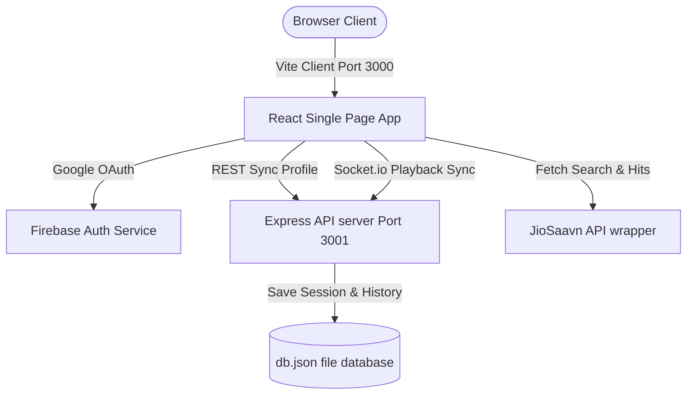

# Music2D: Retro Brutalist Music Streaming with Jam Rooms

Music2D is a premium, retro-brutalist styled music player built with React, Vite, Tailwind CSS, Express, and Socket.io. It integrates with an unofficial JioSaavn API to stream real audio files and implements real-time room sharing (Jam together) and Firebase Google OAuth authentication.

## Features

1. **JioSaavn API Integration**: Dynamically search, fetch, and play high-quality 320kbps audio files directly from the JioSaavn database.
2. **Dual Playback Engine**: Seamlessly falls back between browser HTML5 audio streaming and vintage low-pass synthesizer audio beep swept frequencies.
3. **Firebase Google OAuth**: Login and sign up securely using your Google account.
4. **Account-Based Syncing**: Your recently played history, liked songs, custom playlists, and friends list are saved in a local database (`db.json`) synced with your login.
5. **Real-time Jam Together Stations**: Launch your own streaming station or tune in to others to sync playback, seek position, play/pause actions, and chat live via WebSockets.

---

## Setup & Running Locally

### 1. Prerequisites
- [Node.js](https://nodejs.org/) (v18 or higher recommended)

### 2. Environment Variables (`.env`)
To enable Firebase authentication, copy the Firebase Web SDK credentials from your Firebase console:
```env
# Firebase Authentication Web SDK Configuration
VITE_FIREBASE_API_KEY="your_api_key_here"
VITE_FIREBASE_AUTH_DOMAIN="your_auth_domain_here"
VITE_FIREBASE_PROJECT_ID="your_project_id_here"
VITE_FIREBASE_STORAGE_BUCKET="your_storage_bucket_here"
VITE_FIREBASE_MESSAGING_SENDER_ID="your_sender_id_here"
VITE_FIREBASE_APP_ID="your_app_id_here"
```
*Note: If no Firebase configuration is specified, the application will automatically fall back to a local mock/dev credentials profile so you can still preview the login and dashboard functionality!*

### 3. Install Dependencies
Run the following command to download package requirements:
```bash
npm install
```

### 4. Start Development Environment
Run the unified development script, which launches both the Express Socket.io backend server (port `3001`) and the Vite React frontend dev server (port `3000`) concurrently:
```bash
npm run dev
```

Open your browser at [http://localhost:3000](http://localhost:3000) to view the app!

---

## Architecture Diagram



## Available Scripts

- `npm run dev`: Run both backend and frontend servers.
- `npm run build`: Compile frontend code to the `dist` production bundle.
- `npm run preview`: Serve the compiled frontend production bundle locally.
- `npm run clean`: Clean up compiled directories.
- `npm run lint`: Run TypeScript compiler checks.
